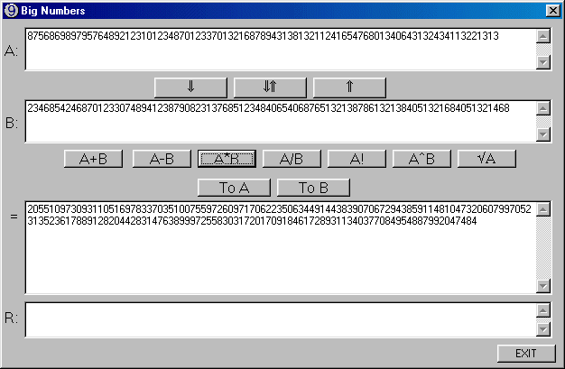



## Big Numbers

### Description

Perform big integer calculations (now up to 80000 digits, but can use more). Implemented are +, -, *, /, !, power and square root. Use integer calculations, so it is faster than string calculations programs.

If you find any error, please let me know.

If you like this code, please vote.
 
### More Info
 
Big integer numbers.

Results of mathematical operations.

             |
---                |---
**Submitted On**   |2001-12-05 15:14:10
**By**             |[EKabiljo](https://github.com/Planet-Source-Code/PSCIndex/blob/master/ByAuthor/ekabiljo.md)
**Level**          |Intermediate
**User Rating**    |4.6 (41 globes from 9 users)
**Compatibility**  |VB 4\.0 \(32\-bit\)
**Category**       |[Math/ Dates](https://github.com/Planet-Source-Code/PSCIndex/blob/master/ByCategory/math-dates__1-37.md)
**World**          |[Visual Basic](https://github.com/Planet-Source-Code/PSCIndex/blob/master/ByWorld/visual-basic.md)
**Archive File**   |[Big\_Number395971252001\.zip](https://github.com/Planet-Source-Code/ekabiljo-big-numbers__1-29460/archive/master.zip)

